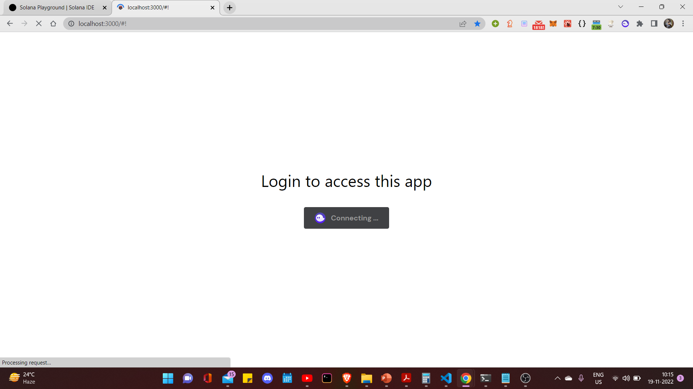
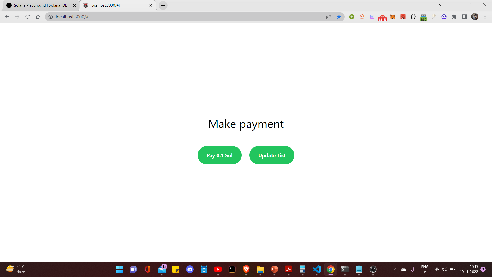
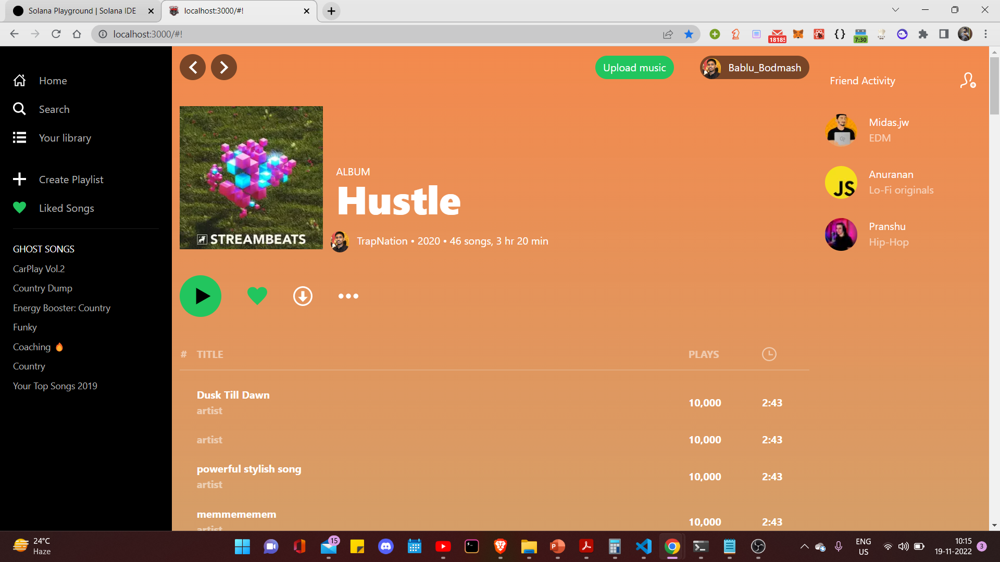
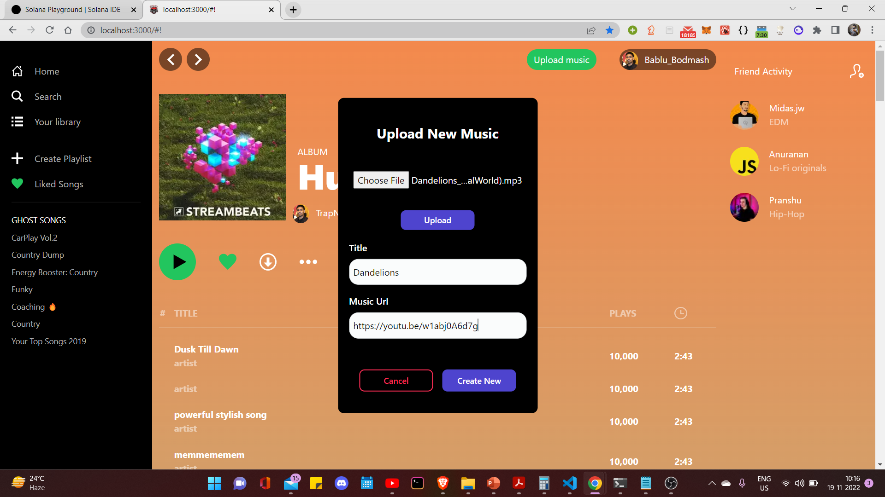
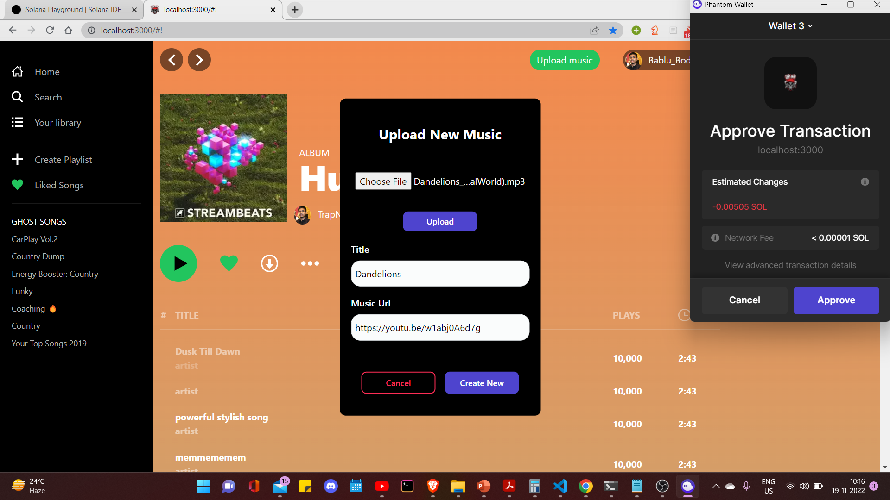
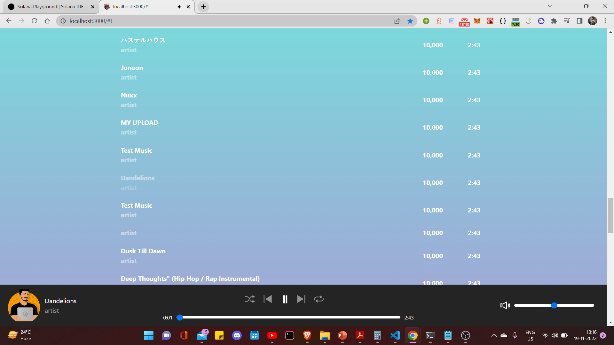

# STUDIOUS

## Inspiration 💡
This dApp aims to solve an issue widely faced by the music artist community - Independent artists find it hard to earn money through their compositions online (music streaming) specifically when they're starting. It's difficult to find gigs at the beginning of their careers and hence funding the music production operation becomes a costly affair.
## What it does ⚙️
Studious is powered by cryptocurrency, using future-proof blockchain &
smart contract technology to connect artists, fans, and investors like never
before. Musicians are unable to receive the deserved
revenue/share/royalty from their art form via currently available platforms
(Source: Forbes). We aim to create a platform that leverages the artist from
his/her dependency on the platform for providing their desired share.
## How we built it ⚒️
We built using Solana blockchain using Rust and next js.
## Challenges we ran into ❌
Studious also helps fans connect on a
deeper level with their music idols.
Studious makes it possible to connect fans
and musicians like never before. Also, it
doesn't matter if you're a bathroom singer,
a growing YouTube/Instagram star, or a
famous musician. Anyone can create NFTs
of their music using Studious!
## Accomplishments that we're proud of 😊
We have made a working app and run it on the localhost through which one can upload music and also listen to it.
## What we learned 👨‍🔬
The music industry is in a state of flux. The demise of the vinyl disks and the rise of digital downloads in favour of online music streaming has significantly sthavegled profits, particularly for the artists themselves.

Musicians are struggling to make sense of the mess that is royalty distribution in its present form and find it difficult to keep a fair share of the revenue they generate on existing platforms.
## What's next for Studious ⏭️
Making a mobile app for this current web app.

## Build
```
- git clone https://github.com/RajAdwaita/Studious.git
- cd Studious
- cd music-project
- npm install --legacy-peer-deps
- npm run dev
```

## Screenshots







